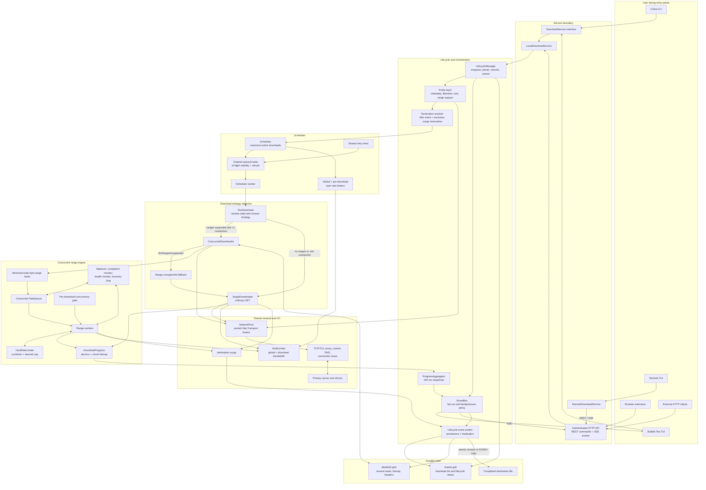

# Surge Architecture

## System overview

## Request lifecycle

1. A request arrives from the CLI or TUI through `DownloadService`, or through the authenticated HTTP API from the browser extension, remote TUI, or another client.
2. `LifecycleManager` probes the URL to determine its filename, size, and range support. It checks available disk space and exclusively creates `filename.surge` to reserve the destination.
3. The queued record is persisted before `Scheduler.Add` is called, preventing a fast download from racing ahead of durable queue state.
4. `Scheduler` limits the number of simultaneous downloads and attaches the global and per-download bandwidth limiters.
5. A scheduler worker calls `RunDownload`, which chooses the concurrent or single-stream strategy.
6. Progress and lifecycle events flow through `EventBus` to the TUI, SSE clients, and lifecycle event worker.
7. On completion, the lifecycle event worker moves the `.surge` working file to its final path and updates persistent history.

## Service boundary

`DownloadService` is the common interface used by the TUI and command layer. It has two implementations:

- `LocalDownloadService` calls the embedded `LifecycleManager` directly.
- `RemoteDownloadService` calls a running Surge daemon over REST and receives events through SSE.

The browser extension and external tools use the same authenticated HTTP API. This keeps lifecycle behavior in one place regardless of whether a request originated locally or remotely.

## Lifecycle and probing

`LifecycleManager` owns operations that surround the transfer itself:

- coalescing identical concurrent enqueue requests;
- limiting simultaneous probes;
- resolving categories, filenames, and output paths;
- validating free disk space for known-size downloads;
- atomically reserving a unique `.surge` path;
- constructing the canonical `DownloadRecord`;
- persisting queued state before handing work to the scheduler;
- coordinating pause, resume, cancellation, and URL updates.

Probe traffic uses the same proxy and custom DNS configuration as the eventual download. Probes to the same host are serialized to reduce avoidable rate limiting.

## Scheduler

The scheduler owns download-level concurrency, not byte-range concurrency. It maintains:

- an ordered queue of `queuedTask` values;
- active download cancellation and completion handles;
- a fixed set of scheduler workers controlled by `MaxConcurrentDownloads`;
- one shared timer for delayed retries;
- a global byte limiter and one limiter per download.

A failed transient download is requeued with `retryAt`. Waiting scheduler workers ignore it until the shared retry timer broadcasts that the earliest delayed task is runnable. Cancellation, permanent HTTP errors, disk-full errors, and context termination bypass retries.

## Strategy selection

`RunDownload` selects the smallest suitable implementation:

- `SingleDownloader` is used when the server does not support ranges or when the effective connection count is one.
- `ConcurrentDownloader` is used when range requests are supported and multiple connections are useful.
- If a supposedly range-capable server returns an ordinary `200 OK` for a partial request, the concurrent engine returns `ErrRangeUnsupported`. `RunDownload` resets the working file and falls back to `SingleDownloader`.

The single downloader performs one ordinary GET. It cannot resume because it is specifically used for servers where byte ranges cannot be trusted.

## Concurrent range engine

The concurrent downloader restores saved tasks for a resume or partitions a new file into byte ranges. The main pieces are:

- `TaskQueue`: distributes pending byte ranges to workers.
- Range workers: issue HTTP range requests and write successful bytes directly to their offsets with `WriteAt`.
- `adaptiveConcurrencyGate`: keeps worker goroutines alive while parking any that exceed the current per-download cap.
- Balancer: splits remaining work when idle workers can help.
- Health monitor: detects stalled or unhealthy range workers.
- Completion monitor: closes the queue after all queued, active, and parked work is accounted for.
- `DownloadProgress`: stores atomic byte counters, worker counts, mirror state, pause state, and the chunk bitmap.

## Rate limiting and adaptive concurrency

Three independent controls are involved:

1. The global byte limiter restricts aggregate process bandwidth.
2. The per-download byte limiter restricts one download's bandwidth.
3. `HostRateLimiter` coordinates server-directed cooldowns and, when adaptive concurrency is enabled, stores a learned concurrency cap per host.

`MultiLimiter` combines the first two controls for every read. The host policy handles `429`, retryable `503`, and repeated soft `403` responses.

Adaptive concurrency is opt-in through a positive `AdaptiveConcurrencyInterval`:

- When disabled, the requested worker count is preserved. Host cooldowns still prevent immediate retries, but they do not change the current or learned concurrency cap.
- When enabled, a new download starts from the host's learned cap. A new throttle episode reduces it, and healthy byte/range progress gradually raises it.
- Each cooldown schedules gate recovery. Recovery clears the shared `RateLimited` progress flag so UI and API clients stop reporting a stale throttled state.

Throttle episode timestamps are copied into `DownloadRecord` across scheduler retries, preventing a recreated downloader from receiving a fresh no-progress budget.

## Transport layer

`NetworkPool` leases shared `http.Transport` instances keyed by proxy, custom DNS, and connection limit. This provides:

- TCP keep-alive and connection reuse;
- shared TLS session caching;
- proxy and custom DNS support;
- bounded idle transport cleanup;
- the same network path for probes, concurrent downloads, and single downloads.

The transport has a process-wide connection ceiling. Per-download request concurrency is enforced by workers and the concurrency gate rather than by creating isolated transports.

## Progress and events

Workers update `DownloadProgress` directly. `ProgressAggregator` samples active records every 150 milliseconds, calculates smoothed speed, and publishes batched progress events. Chunk bitmap snapshots are emitted less frequently to reduce copying.

Terminal lifecycle events such as queued, started, paused, completed, removed, and errored are emitted directly. `EventBus` uses different backpressure policies:

- progress events may be dropped for a slow listener because a newer snapshot supersedes them;
- lifecycle events receive bounded blocking delivery because each state transition matters.

The TUI and SSE API subscribe to the same stream. The lifecycle event worker is also a subscriber and translates events into durable state changes.

## Persistence and files

Persistence uses atomically replaced Gob files rather than a live SQL database:

- `master.gob` contains the download list, status, paths, and history metadata;
- `details/<id>.gob` contains resumable tasks, the chunk bitmap, request headers, mirrors, and transfer-specific state;
- `filename.surge` is the reserved working file.

On pause or a resumable failure, the concurrent downloader snapshots all queued, active, and abandoned ranges. On completion, the lifecycle event worker atomically renames the working file. If source and destination cross filesystem boundaries, it falls back to copy, sync, and removal.

At startup, Surge normalizes downloads left in `downloading` state, validates persisted records against their working files, removes corrupt or orphaned state, and optionally resumes paused downloads.

## Canonical data structures

- `DownloadRecord` carries static configuration, durable resume state, runtime handles, and transient scheduler retry state across the engine.
- `DownloadProgress` is the live, concurrency-safe transfer state read by the progress aggregator.
- `DownloadEvent` is the message format used between the engine, lifecycle worker, TUI, and remote clients.
- `Task` describes an unfinished byte range with an offset and length.

Keeping these roles separate prevents high-frequency progress updates from rewriting durable state while still allowing pause and crash recovery to capture an exact resumable snapshot.
